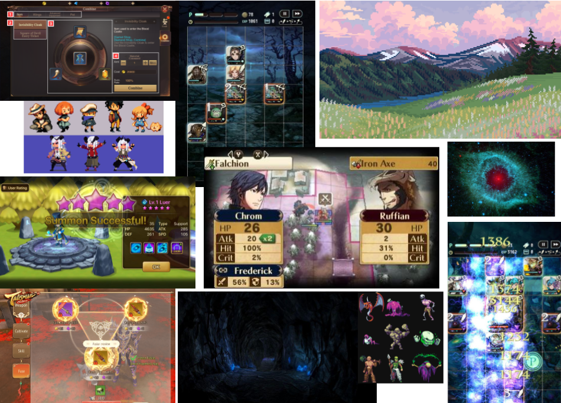

# Navigacha
## Vision

Travel through the Planes of existence with your Navigation powers to discover new worlds. Bloodcurdling dungeons and mysterious creatures will get in your way, but fear not! You can contract Heroes all across the already discovered Planes. They are masters of weaponry, skilled spellcasters or unstoppable fighters. And they’ll help you advance to the next world. Will you be the first to arrive on the Last Plane?

## Core game pillars
* **Items and weapons**: The crafting system to generate unique weapons with *Arts*.
* **Combat**: Turn-based system in a board-like map.
* **Characters' Skills**: Called *Arts*.
* **Dungeons**: Grid board with different layouts.

## Moodboard
1-Theme: Fantasy world. 2-Genre: Gacha RPG. 3-Main mechanics: Turn-based combat, Forging. 4-Art Style: pixel-art (anime-like??). 5-WTF: 

## Gameplay
### Combat
It takes place on a grid-like board map representing the dungeon. You have a team of three to five contracted Heroes. Each of your Heroes takes up one square. There are enemies in the map and they can be small (1 square), medium (4 medium) and large (9 squares). 

The combat develops in turns. A turn has 2 phases:

_**Move (Tactics) phase**_
* In the move phase you can drag each of your units anywhere over the grid. 
* Each unit has a timer during which they can move. The timer also ends if you let go of the character (you have to drag).  Timer starts once you press a unit. Timer duration depends on each unit’s speed. 
* When one of your units passes through an enemy, it interacts with it.

_**Skills (Arts) phase**_

After the move phase, comes the skills/action phase. 
* Each of your units can select a skill/spell (arts, in game) to cast.

Once your turn is finished, the enemies will have their turn. Then, it’s your turn again.

### Gacha and management
You are a Traveler climbing the Planes. Each of them contains several dungeons. To clear those dungeons, you’ll need to contract Heroes, summoned from across the already visited Planes.

The gacha will be only for units (Heroes), all the equipment will come from looting in combat.

You will have a collection of Heroes from which you will be able to select a team to explore each dungeon. Furthermore, from the collected items, you will create weapons and armor to form different sets of equipment. A set consisting of a weapon, an armor and an accessory. The equipment sets are not bound to a specific Hero. Instead, before a combat, you will select a set for each of your units.

Additional management systems will be: item’s forge (relatively complex, specified in GDD), skill upgrades system.

